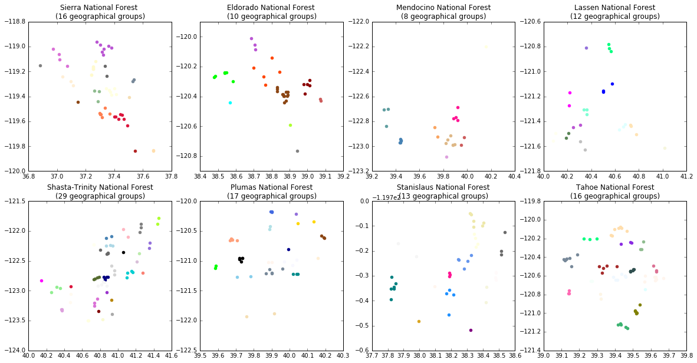

# CampStatus: scrape NFS websites for campground statuses

The national forest service has a pretty annoying system
for viewing campground statuses in bulk. CampStatus scrapes
NFS websites for campground and trailhead information (for backpacking).
The following data are scraped or interpreted from the website text
(if available):

* Information in the "At a glance" table, including water, toilets,
  reservations, *etc.*
* latitude and longitude
* elevation
* Category of campground (not implemented)
	* [Determine](https://github.com/oerbilgin/campstatus/issues/8)
	  if the campground is a group site, backpacking site, *etc.*
* transportation (not implemented)
	* What roads are [near by](https://github.com/oerbilgin/campstatus/issues/12)
	* What are the [driving time estimates](https://github.com/oerbilgin/campstatus/issues/11)
	  from "home"
	* If the campground is a
	  [walk-in/boat-in](https://github.com/oerbilgin/campstatus/issues/9)
	  or if it has parking

The latitude and longitude data are used for geospatial analyses, including:

* geographic clustering
	* Campgrounds are clustered geographically using the K-means algorithm.
	* 
* linking to natural features (not implemented)
	* [GIS data](https://github.com/oerbilgin/campstatus/issues/12)
	  is used to link campgrounds to the nearest natural feature
	  such as a river, lake, or peak.

The final csv has the following columns:
<table border="1" class="dataframe">
  <thead>
    <tr style="text-align: right;">
      <th></th>
      <th>Campground</th>
      <th>Status</th>
      <th>Fees</th>
      <th>Open Season</th>
      <th>Reservations</th>
      <th>Restroom</th>
      <th>Potable Water</th>
      <th>Elevation</th>
      <th>Latitude</th>
      <th>Longitude</th>
      <th>Usage</th>
      <th>Water</th>
      <th>URL</th>
      <th>Forest</th>
      <th>Geo Group</th>
    </tr>
  </thead>
  <tbody>
    <tr>
      <th>0</th>
      <td>Chilkoot Campground</td>
      <td>Open</td>
      <td>$23.62</td>
      <td>May - September</td>
      <td>reservations only</td>
      <td>Vault</td>
      <td>False</td>
      <td>4600.0</td>
      <td>37.368460</td>
      <td>-119.536662</td>
      <td>Heavy</td>
      <td>No</td>
      <td>https://www.fs.usda.gov/recarea/sierra/recreat...</td>
      <td>Sierra National Forest</td>
      <td>9.0</td>
    </tr>
    <tr>
      <th>1</th>
      <td>Forks Campground</td>
      <td>Open</td>
      <td>$30.00</td>
      <td>May</td>
      <td>reservations only</td>
      <td>Flush</td>
      <td>True</td>
      <td>3400.0</td>
      <td>37.312454</td>
      <td>-119.567827</td>
      <td>Light</td>
      <td>Yes</td>
      <td>https://www.fs.usda.gov/recarea/sierra/recreat...</td>
      <td>Sierra National Forest</td>
      <td>9.0</td>
    </tr>
  </tbody>
</table>

* Geo Group has the result of the clustering algorithm. The groups are
  intra-forest. Campgrounds with the same group ID are geographically
  close together.
* If an entry is blank, the data either was not on the webpage for the
  campground or it was not parsed correctly
* In the Reservations column 'fcfs' stands for "first come first served"

It also optionally interfaces with Google Sheets, writing a new sheet and/or
updating to-date campground status.

An example google sheet is [here](https://docs.google.com/spreadsheets/d/19TrtOtNcBHffXP1NFfz_XB_7xb3LbexpjVSGjyKpHWo/edit?usp=sharing). 

## Dependencies
* [numpy](http://www.numpy.org/)
* [pandas](https://pandas.pydata.org/)
* [scikit-learn](http://scikit-learn.org/stable/index.html)
* [geopy](https://github.com/geopy/geopy)
* [requests](http://docs.python-requests.org/en/master/)
* [BeautifulSoup](https://www.crummy.com/software/BeautifulSoup/)
* [re](https://docs.python.org/2/library/re.html)
* [gspread](https://github.com/burnash/gspread)
* [oauth2client](https://github.com/google/oauth2client)
